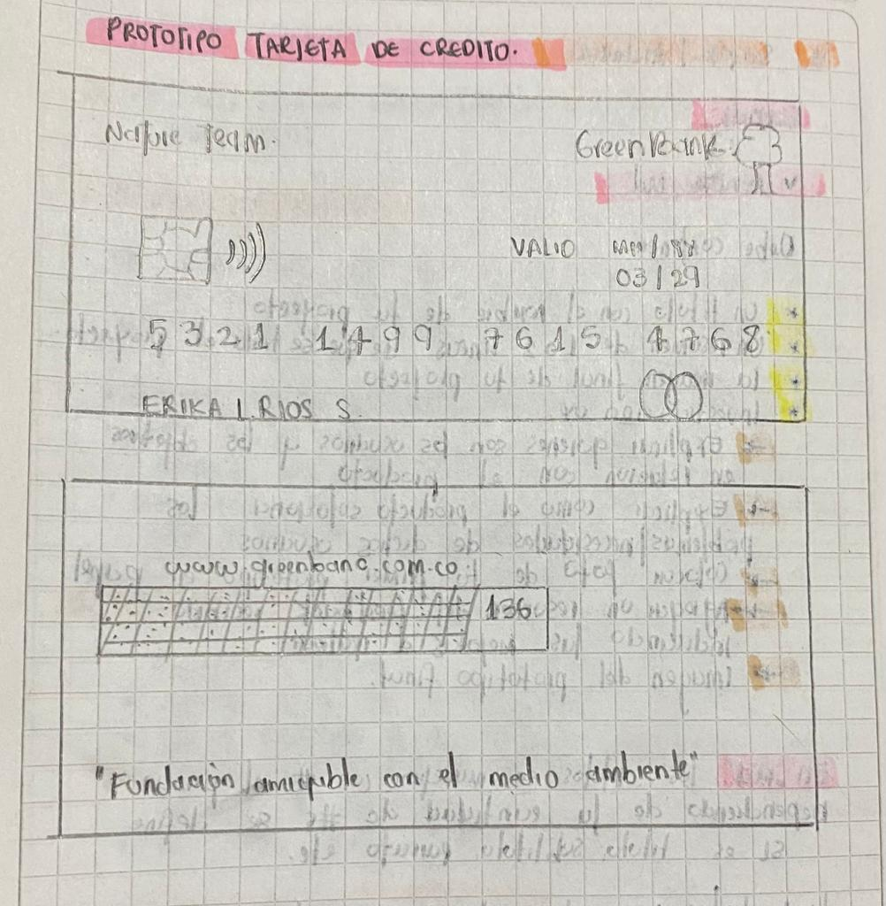
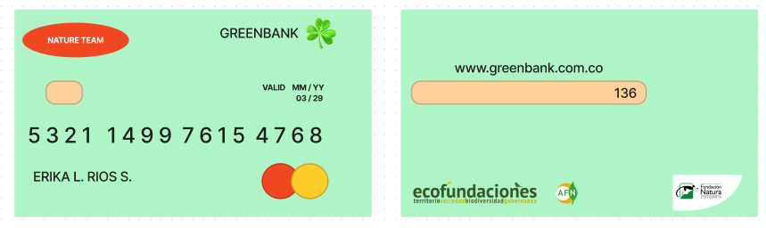

# **PROYECTO TARJETA DE CRÉDITO**
# **GREENBANK**

Es una tarjeta de crédito que esta enfocada en usuarios que son ecofriendly, será un producto elaborado con plástico reciclado, aparte el usuario tendrá una mejor experiencia porque su verificación será solamente por medio del código de seguridad. 

## **Definición del producto**

### **¿Quienes son los principales usuarios del producto?**

Los prinicpales usuarios de este producto ofertado será la población amigable con el medio ambiente, ya que uno de los beneficios que tiene adquirir este producto es la ayuda a fundaciones que estan en pro al cuidado del medio ambiente. 

### **¿Cuáles son los objetivos de estos usuarios en relación con tu producto?**

- Aportar a la optimización de productos reciclados, porque será una tarjeta hecha con plástico reciclado.
- Aportar al cuidado del medio ambiente.
- Facilidad y beneficios para el usuario al momento de ingresar a la plataforma.
- Alianzas con marcas que elaboren productos que tengan procesos sostenibles y que no impacten al medio ambiente.

### **¿Cómo crees que el producto que estás creando está resolviendo sus problemas?**

El usuario al adqurila:
- Estará acorde con sus ideologías acerca del cuidado del medio ambiente
- Será una tarjeta segura porque permitirá que sus datos no sean visibles en el momento de la validación o verificación.
- Aportará al cuidado del medio ambiente
- Verificación solo con el código de seguridad
- Exenta de cuota de manejo y podrá tener mayor control de gasto
- Aceptación a nivel mundial ya que contribuye a una buena causa.

## **Prototipo tarjeta de crédito blanco y negro**

## **Prototipo tarjeta de crédito diseño Figma**

